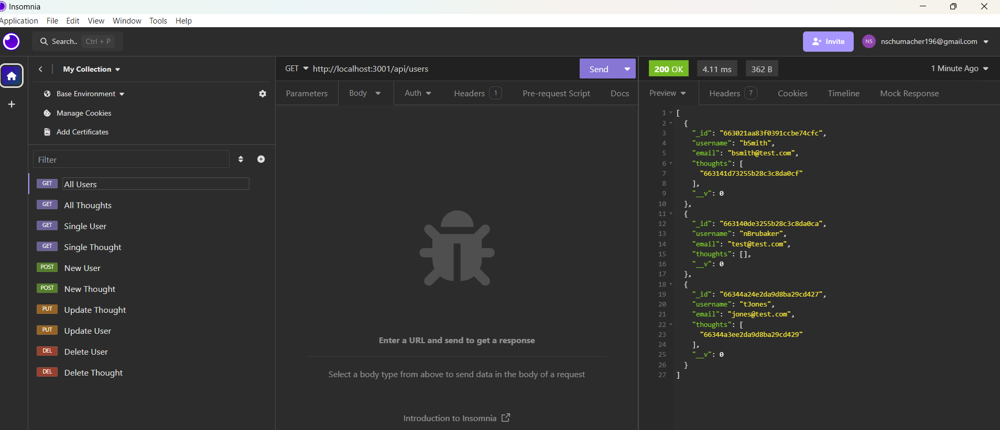

# Social-Network

## Project Overview
This is a social media app, where a user can be created, they can also have thoughts associated with their user, and friends can post reactions to their thoughts. There is no UI, this is a server side application only - with data being sent via Insomnia.

## Installation and Setup
Clone the repository to your local machine.
npm install
npm run dev 
To test data is being sent and stored properly, we suggest using Insomnia to test routes.

## Technologies Used
- Javascript
- Express.js
- MongoDB
- Mongoose ODM

## License
MIT (https://choosealicense.com/licenses/mit/)

## Status & Future Development
I would like to finish out this project by adding in friends & reactions. I didn't quite get through all requirements for the project.

Video walk through: https://drive.google.com/file/d/135EnAcNVOblZUYoAN-lEkMIaXdObw1VP/view

GitHub Repo: https://github.com/NicoleBrubaker/Social-Network

Working app:

